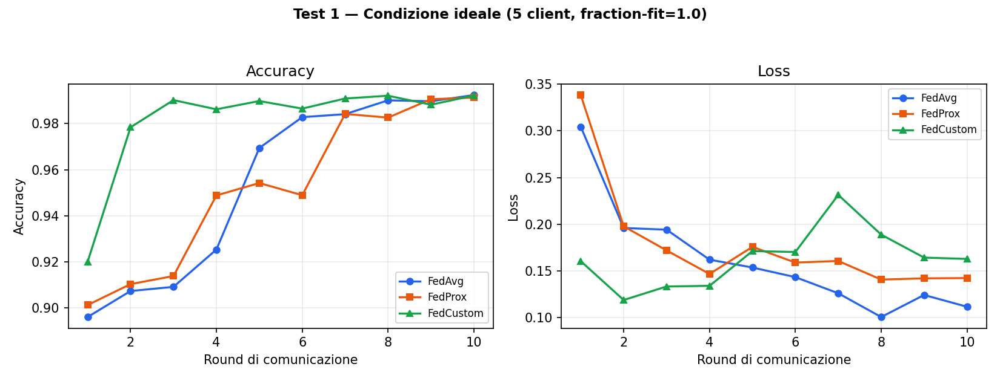
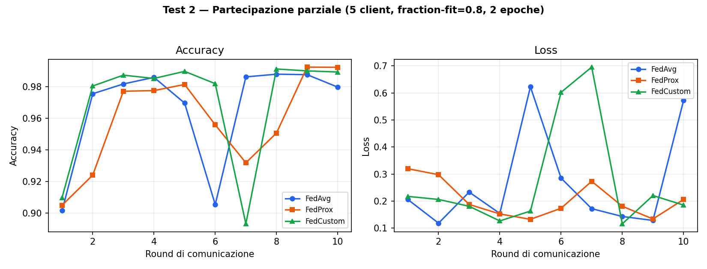
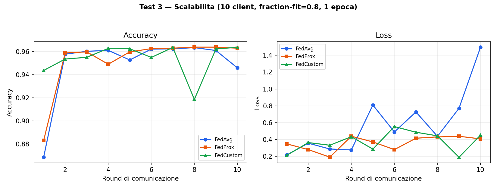
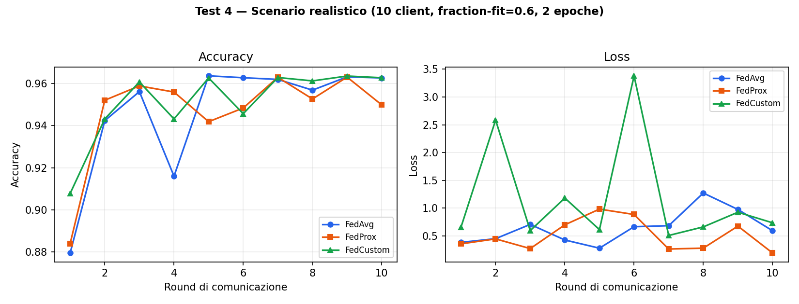

# Federated Intrusion Detection with Flower


A federated Network Intrusion Detection System (IDS): clients train a shared
model locally on non-IID network traffic partitions, and only model updates
— never raw data — are exchanged with a central server. Built with
[Flower](https://flower.ai/) and PyTorch, evaluated on
[CIC-IDS2017](https://www.unb.ca/cic/datasets/ids-2017.html), a widely used
benchmark of realistic network traffic captures (benign + DoS/DDoS,
port scanning, infiltration, web attacks) developed by the Canadian
Institute for Cybersecurity.

## Background

This project started as the case study for my Bachelor's degree thesis in
Computer Engineering at the University of Bologna, on Federated Learning
applied to network intrusion detection. The results below are as obtained
during that work; the items in the [roadmap](#roadmap--known-limitations)
are improvements I'm making independently, after graduation, as I turn it
into a proper portfolio project.

## Why this project

Beyond the two standard aggregation strategies — **FedAvg** and
**FedProx** — this project implements **FedCustom**: a custom Flower
`Strategy` that re-weights each client's contribution not just by dataset
size (as FedAvg does), but by how balanced that client's local
benign/attack split is. The motivation: CIC-IDS2017 is dominated by benign
traffic, so a client whose local partition is almost entirely benign pushes
the global model to under-attend to the minority (attack) class — exactly
the class an IDS exists to catch.

```python
frac_attack = fit_res.metrics.get("frac_attack", 0.5)
frac_benign = 1.0 - frac_attack
balance_weight = 2 * min(frac_attack, frac_benign)  # 1.0 at a 50/50 split, 0 at a fully one-sided split
custom_weight = fit_res.num_examples * balance_weight
```

Four experiments compare the three strategies under increasing realism —
from an ideal, fully-participating setup to a scenario combining partial
client participation, more clients, and more local training. **FedProx was
the most stable under heterogeneity; FedCustom converged fastest in the
ideal case but was noticeably less robust once partial participation and
more local epochs were combined** (see [Results](#results), Test 4 in
particular).

## Results

Client data is split with a **Dirichlet distribution** (`alpha=0.5`) over
the attack/benign label, a standard technique in FL research for
simulating non-IID data across clients — some clients end up with an
almost entirely benign local dataset, others with a much higher attack
share, mirroring how real network traffic would differ across deployment
sites.

### Test 1 — Ideal condition
5 clients, `fraction-fit=1.0`, minimal local epochs.

FedCustom converges fastest (>97% accuracy by round 2); FedAvg and FedProx
reach comparable final accuracy more gradually.

### Test 2 — Partial participation
5 clients, `fraction-fit=0.8`, 2 local epochs.

FedProx's proximal term keeps the loss visibly more stable than FedAvg or
FedCustom, both of which show sharp loss spikes in some rounds.

### Test 3 — Scalability
10 clients, `fraction-fit=0.8`, 1 local epoch.

FedAvg's loss trends upward over rounds (model divergence); FedProx stays
the most controlled as the client population grows.

### Test 4 — Realistic scenario
10 clients, `fraction-fit=0.6`, 2 local epochs — partial participation,
more clients, and more local training combined. This is also the default
configuration in `pyproject.toml`.

FedAvg fails to converge cleanly; FedProx remains the most resilient;
FedCustom is noticeably less stable here than in the ideal case, with the
loss spiking well above 2.5 in some rounds — its balance-based weighting
alone isn't enough to compensate for participation dropout combined with
more local drift.

> **Reading these results:** only accuracy and loss are reported so far.
> On an imbalanced binary task (benign traffic dominates), high accuracy
> alone doesn't prove the attack class is being detected well —
> precision/recall/F1 on the attack class are needed to actually support
> claims like "strategy X beats strategy Y". This is the top item on the
> roadmap below; treat the comparisons above as directional, not final.

## Project structure

```
federated-ids-flower/
├── ids_project/
│   ├── task.py            # model (MLP), training/eval loops, data loading
│   ├── client_app.py      # Flower ClientApp / NumPyClient
│   ├── server_app.py      # Flower ServerApp, strategy wiring
│   ├── FedCustom.py       # custom balance-aware aggregation strategy
│   └── Preprocessing.py   # CIC-IDS2017 cleaning + Dirichlet partitioning
├── results/                # result charts (regenerated from logged data)
├── pyproject.toml
└── README.md
```

## Getting started

```bash
git clone https://github.com/fralo/federated-ids-flower.git
cd federated-ids-flower
pip install -e .
```

Requires Python 3.10+. See `pyproject.toml` for the full dependency list
(Flower, PyTorch, scikit-learn, pandas, numpy, HuggingFace `datasets`).

## Reproducing the experiments

1. Download the CIC-IDS2017 CSV files you need from the
   [official dataset page](https://www.unb.ca/cic/datasets/ids-2017.html)
   and place them under `data/` (see the file list at the bottom of
   `Preprocessing.py`).
2. Run the preprocessing + partitioning script:
   ```bash
   python ids_project/Preprocessing.py
   ```
   This produces `data/train_partition_<id>.pt` and
   `data/test_partition_<id>.pt` for each simulated client.
3. Run the federated simulation:
   ```bash
   flwr run .
   ```
   Round count, learning rate, batch size, and participation fraction are
   configurable in `[tool.flwr.app.config]` in `pyproject.toml`, or via
   `flwr run . --run-config "num-server-rounds=5"`.

Raw and partitioned data files are intentionally excluded from this
repository via `.gitignore` (CIC-IDS2017 is tens of GB in full; only a
subset of daily captures is used here, see `Preprocessing.py`).

## Roadmap / known limitations

Being upfront about what's not done yet, roughly in priority order:

- [ ] **Precision / recall / F1 on the attack class** (not just accuracy) —
      needed before any claim about which strategy "performs better" is
      actually defensible on this imbalanced task.
- [ ] **Centralized baseline** (same model, same data, no federation) — to
      quantify what federation actually costs in accuracy, if anything.
- [ ] **Multi-seed runs** — current results are single runs per
      configuration; several of the loss spikes above (especially in
      Test 4) could be seed-specific rather than a property of the
      strategy itself.
- [ ] Discussion of known CIC-IDS2017 issues documented in dataset
      re-analyses (feature redundancy, temporal leakage).
- [ ] FedCustom + FedProx hybrid: add a proximal term to FedCustom's
      balance-based weighting to see if it fixes the Test 4 instability.

## License

Apache License 2.0 — see [LICENSE](LICENSE).
